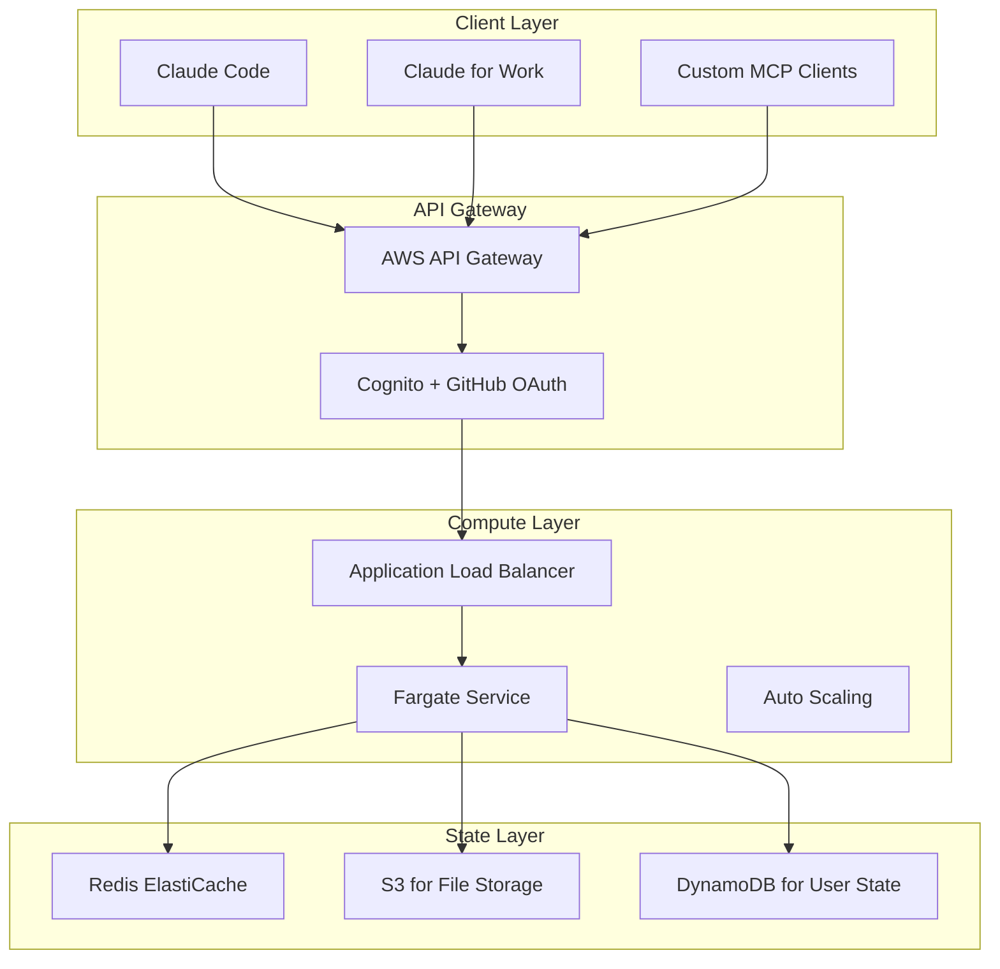

# Zenode AWS Fargate Deployment Plan

## 🎭 AI Council Discussion: Cloud-Native MCP Architecture

*The council convenes with 📋 The Strategist, 🔍 The Detective, and 🧠 The Philosopher to chart the path to AWS Fargate deployment.*

---

## Executive Summary

Deploying zenode as a remote MCP server on AWS Fargate represents a fundamental architectural shift from local Docker containers to cloud-native, multi-tenant infrastructure. Based on the latest MCP developments (June 2025), remote MCP servers are now production-ready with support from major platforms including Cloudflare, Atlassian, and AWS.

## Current State Analysis

### 🔍 The Detective's Investigation:

Let me examine what we know from the latest MCP developments:

1. **Remote MCP is Real**: Cloudflare, Atlassian, and others have deployed production remote MCP servers
2. **Transport Evolution**: Moving from SSE (Server-Sent Events) to Streamable HTTP for better serverless support
3. **Authentication Standard**: OAuth2 with discovery endpoints is the standard
4. **Enterprise Ready**: Anthropic promises toolkits for Claude for Work organizations

**Key Evidence from 2025**:
- Cloudflare provides `workers-oauth-provider` and `mcp-remote` adapter
- Atlassian's remote MCP respects existing permission controls
- AWS blog confirms MCP works "across both local and remote implementations"

## Architecture Design

### 📋 The Strategist's Blueprint:

Here's how we transform zenode for AWS Fargate:



### Transport Layer Implementation

Based on MCP 2025 specs, we need dual transport support:

```typescript
// Legacy SSE Transport (for compatibility)
app.get('/sse', authenticate, (req, res) => {
  res.writeHead(200, {
    'Content-Type': 'text/event-stream',
    'Cache-Control': 'no-cache',
    'Connection': 'keep-alive'
  });
  
  // Handle MCP messages over SSE
});

// Modern Streamable HTTP Transport (for Fargate)
app.post('/mcp/v1/message', authenticate, async (req, res) => {
  const response = await handleMCPMessage(req.body);
  res.json(response);
});
```

## Open Questions & Challenges

### 🧠 The Philosopher's Contemplations:

1. **File System Access in the Cloud**
   - How do tools access user files when running in Fargate?
   - Do we implement S3-based virtual filesystem?
   - Should users upload files or provide pre-signed URLs?

2. **Session State Management**
   - How long do we keep Fargate tasks running per user?
   - Cost implications of persistent vs on-demand containers?
   - Redis for conversation state, but what about active tool execution?

3. **Multi-Tenancy Architecture**
   - One Fargate task per user vs shared tasks with isolation?
   - How to handle resource limits and quotas?
   - Security boundaries between users?

4. **Authentication Flow**
   ```
   User -> GitHub OAuth -> AWS Cognito -> API Gateway -> Fargate
   ```
   But how do we handle:
   - Token refresh for long-running connections?
   - Permission scoping per repository/organization?
   - Rate limiting per user/org?

## Technical Requirements

### 🔍 The Detective's Checklist:

**OAuth2 Discovery Endpoints** (Required by MCP spec):
```typescript
// /.well-known/oauth-protected-resource
{
  "resource": "https://api.zenode.cloud",
  "oauth_authorization_server": "https://auth.zenode.cloud"
}

// /.well-known/oauth-authorization-server
{
  "issuer": "https://auth.zenode.cloud",
  "authorization_endpoint": "https://github.com/login/oauth/authorize",
  "token_endpoint": "https://auth.zenode.cloud/token",
  "scopes_supported": ["read", "write", "admin"]
}
```

**Fargate Task Definition**:
```json
{
  "family": "zenode-mcp",
  "networkMode": "awsvpc",
  "requiresCompatibilities": ["FARGATE"],
  "cpu": "1024",
  "memory": "2048",
  "containerDefinitions": [{
    "name": "zenode-server",
    "image": "zenode/mcp-server:latest",
    "environment": [
      {"name": "MCP_TRANSPORT", "value": "http"},
      {"name": "REDIS_URL", "value": "${REDIS_ENDPOINT}"},
      {"name": "S3_BUCKET", "value": "${WORKSPACE_BUCKET}"}
    ]
  }]
}
```

## Implementation Phases

### 📋 The Strategist's Roadmap:

### Phase 1: Local Remote MCP (2 weeks)
- Implement HTTP transport alongside stdio
- Add OAuth2 authentication locally
- Test with `mcp-remote` adapter
- Verify Claude Desktop can connect

### Phase 2: AWS Infrastructure (3 weeks)
- Set up Cognito with GitHub OAuth
- Deploy API Gateway with auth
- Configure Fargate service
- Set up ElastiCache Redis

### Phase 3: Multi-Tenancy (4 weeks)
- User isolation and quotas
- S3-based file system abstraction
- Session management
- Cost optimization

### Phase 4: Production Launch (2 weeks)
- Security audit
- Performance testing
- Documentation
- Monitoring and alerting

## Cost Analysis

### Estimated Monthly Costs (100 active users):

```
Fargate (1 vCPU, 2GB): $0.04/hour × 8 hours/day × 30 days × 100 users = $960
API Gateway: $3.50 per million requests × 10M requests = $35
ElastiCache Redis: t3.micro = $13/month
S3 Storage: 1TB = $23/month
Data Transfer: 100GB = $9/month
Total: ~$1,040/month ($10.40 per user)
```

### Cost Optimization Strategies:
1. Use Fargate Spot for 70% discount
2. Scale to zero when inactive
3. Implement aggressive caching
4. Use S3 lifecycle policies

## Security Considerations

### 🔍 The Detective's Security Analysis:

**Critical Security Requirements**:

1. **Zero Trust Architecture**
   - Never trust file paths from clients
   - Validate all operations against user permissions
   - Audit log everything

2. **Data Isolation**
   ```typescript
   // S3 bucket structure
   s3://zenode-workspaces/
     ├── users/
     │   ├── user-123/
     │   │   ├── projects/
     │   │   └── temp/
     │   └── user-456/
   ```

3. **Network Security**
   - VPC with private subnets for Fargate
   - API Gateway as only public endpoint
   - VPC endpoints for S3/DynamoDB

4. **Secrets Management**
   - AWS Secrets Manager for API keys
   - IAM roles for service auth
   - Rotate credentials regularly

## Unresolved Technical Challenges

### 🧠 The Philosopher's Open Questions:

1. **The Workspace Problem**
   - Local MCP assumes filesystem access
   - Cloud MCP has no filesystem
   - How do we bridge this gap elegantly?

2. **The Latency Challenge**
   - Local MCP has ~0ms latency
   - Cloud MCP has 50-200ms per operation
   - How does this affect tool responsiveness?

3. **The State Problem**
   - Tools like `gopher` navigate filesystems
   - How do we maintain state between calls?
   - Should we implement a virtual filesystem?

4. **The Cost Problem**
   - Running containers 24/7 is expensive
   - Cold starts hurt user experience
   - How do we balance cost vs performance?

## Next Steps

### Immediate Actions Required:

1. **Research**: Study Cloudflare's MCP implementation
2. **Prototype**: Build minimal HTTP transport
3. **Test**: Verify Claude can connect remotely
4. **Design**: File system abstraction layer
5. **Estimate**: Detailed cost projections

### Key Decisions Needed:

1. **Architecture**: Monolithic vs microservices?
2. **File Storage**: S3 vs EFS vs hybrid?
3. **Scaling**: Per-user tasks vs shared pools?
4. **Pricing**: Free tier limits? Paid plans?

## Conclusion

The path to AWS Fargate is clear but challenging. The MCP ecosystem has matured significantly in 2025, with production remote deployments proven viable. However, zenode's file-system-centric design requires careful adaptation for cloud deployment.

The key insight: We're not just moving zenode to the cloud - we're reimagining it as a cloud-native service. This requires fundamental changes to how we handle files, state, and user isolation.

**The council agrees**: Proceed with Phase 1 immediately to validate the core assumptions, then iterate based on learnings.